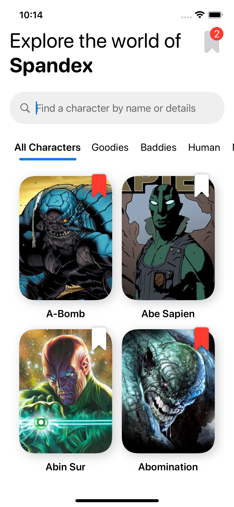
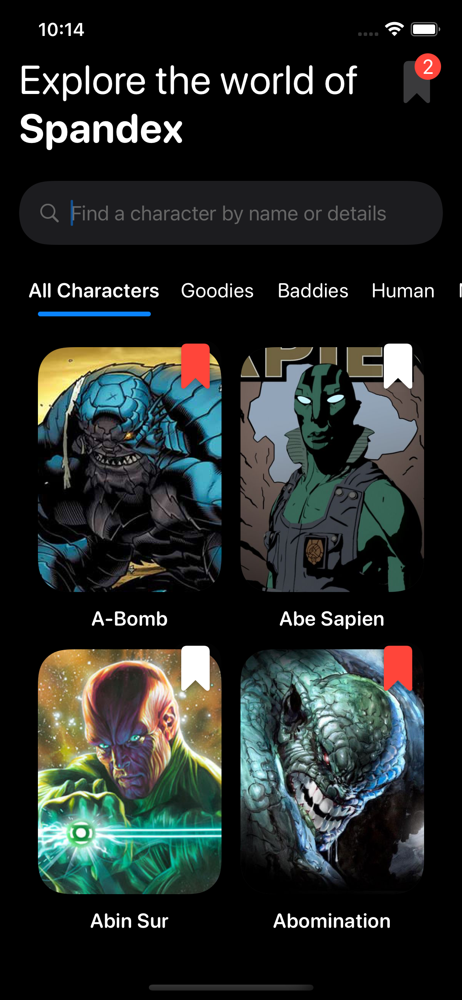
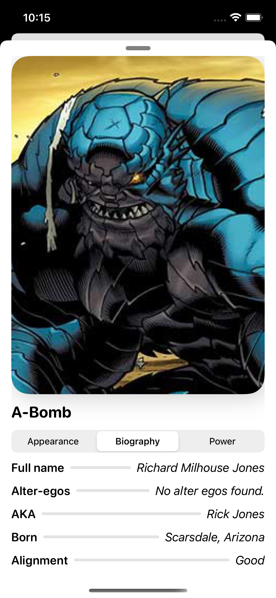

# Spandex

Spandex is a sample app to explore the SuperHero Db API in a SwiftUI 2.0 project.

## Intent
To document the approach behind and thinking about process, design, architecture and handling challenges that arise.

Check [initial-thoughts.md](https://github.com/Codeglee/Spandex/blob/develop/initial-thoughts.md) for initial thoughts.
Check [thinking-out-loud.md](https://github.com/Codeglee/Spandex/blob/develop/thinking-out-loud.md) for ongoing thoughts during development.

## Installation

1. Install [Swiftlint](https://github.com/realm/SwiftLint).
2. Update the Xcode Signing configs to your own team
3. Run it up

## Contributing
While pull requests are not requested, they are welcome. If you spot something wrong or know a better way to do something, please open an issue to discuss the change.

## Licence
[MIT](https://choosealicense.com/licenses/mit/)

## Design
App preview animation - 
Home screen (Light theme) - 
Home screen (Dark theme) - 
Detail screen (Light theme) - 
Detail screen (Dark theme) - 
